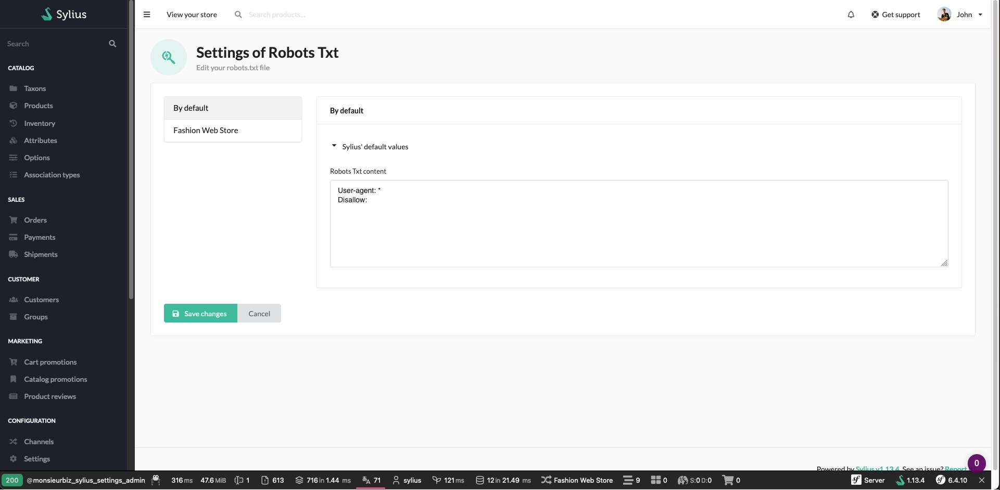

<h1 align="center">Sylius Robots TXT</h1>

[](https://github.com/monsieurbiz/SyliusRobotsTxtPlugin/blob/master/LICENSE.txt)
[](https://github.com/monsieurbiz/SyliusRobotsTxtPlugin/actions?query=workflow%3ATests)
[](https://github.com/monsieurbiz/SyliusRobotsTxtPlugin/actions?query=workflow%3ASecurity)
[](https://github.com/monsieurbiz/SyliusRobotsTxtPlugin/actions?query=workflow%3ASecurity)

Manage your robots.txt from your Sylius admin pannel



## Compatibility

| Sylius Version | PHP Version |
|---|---|
| 1.12 | 8.1 - 8.2 |
| 1.13 | 8.1 - 8.2 |

## Installation

If you want to use our recipes, you can configure your composer.json by running:

```bash
composer config --no-plugins --json extra.symfony.endpoint '["https://api.github.com/repos/monsieurbiz/symfony-recipes/contents/index.json?ref=flex/master","flex://defaults"]'
```

```bash
composer require monsieurbiz/sylius-robots-txt-plugin
```

Then remove your `robots.txt` file from your public directory.
```
rm public/robots.txt
```

<details><summary>For the installation without flex, follow these additional steps</summary>
<p>

[Setup Settings Installation](https://github.com/monsieurbiz/SyliusSettingsPlugin/?tab=readme-ov-file#installation)

Change your `config/bundles.php` file to add this line for the plugin declaration:
```php
<?php

return [
    //..
    MonsieurBiz\SyliusRobotsTxtPlugin\MonsieurBizSyliusRobotsTxtPlugin::class => ['all' => true],
];  
```

Then create the config file in `config/packages/monsieurbiz_sylius_robots_txt_plugin.yaml` :

```yaml
imports:
    resource: '@MonsieurBizSyliusRobotsTxtPlugin/Resources/config/config.yaml'
```

Finally import the routes in `config/routes/monsieurbiz_sylius_robots_txt_plugin.yaml` : 

```yaml
monsieurbiz_robots_txt_render:
    path: /robots.txt
    methods: [ GET ]
    defaults:
        _controller: MonsieurBiz\SyliusRobotsTxtPlugin\Controller\RenderController
```

</p>
</details>

## Contributing

You can open an issue or a Pull Request if you want! 😘  
Thank you!
